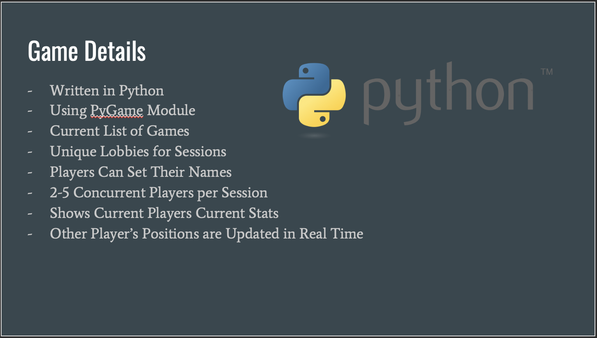
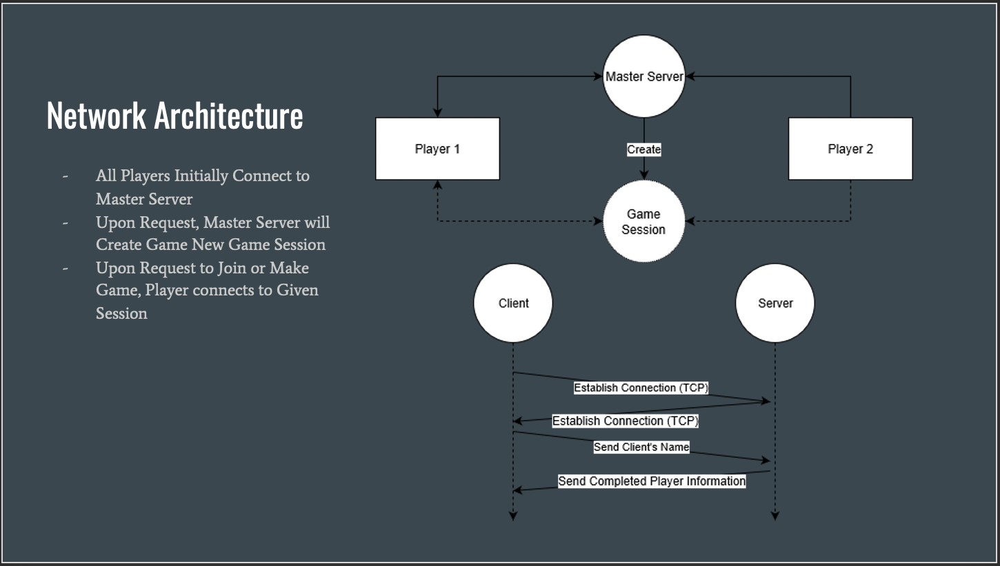
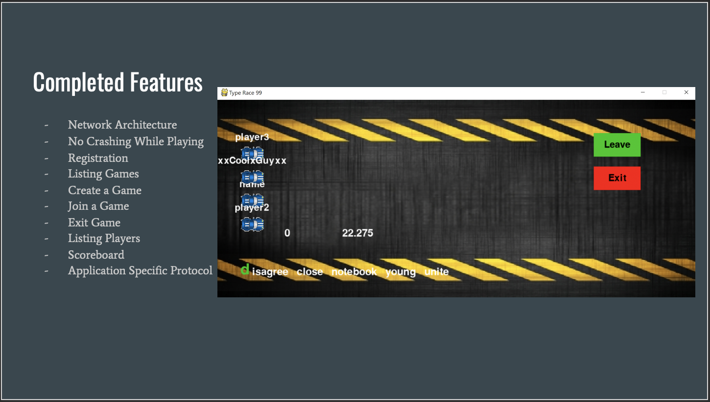
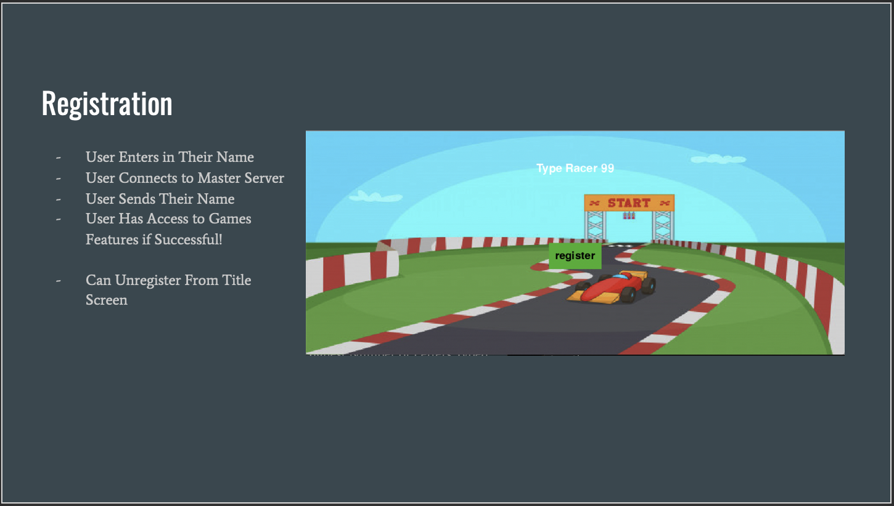
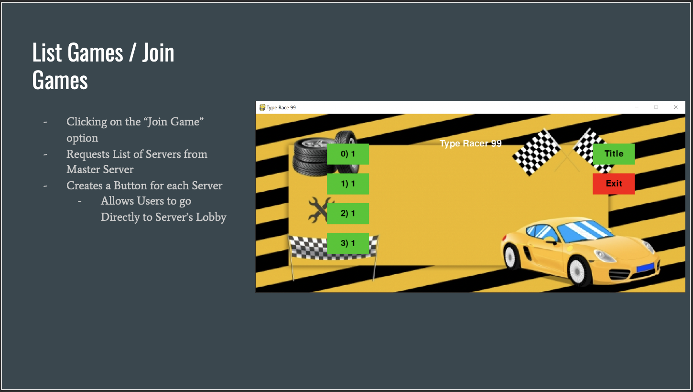

# Multiplayer Type Racing Game

<u>**How to play**</u>

- Run the file on terminal or Pycharm
- After connecting server successfully, click “register” and input a username
- Choose a Game room in Game Lobby
- If no lobby, choose Make Lobby
- You may wait for up to 30 seconds for other players joining in
- Once the game starts, go typing the given texts as fast as you can!
- You can exit the game by clicking “exit” 

